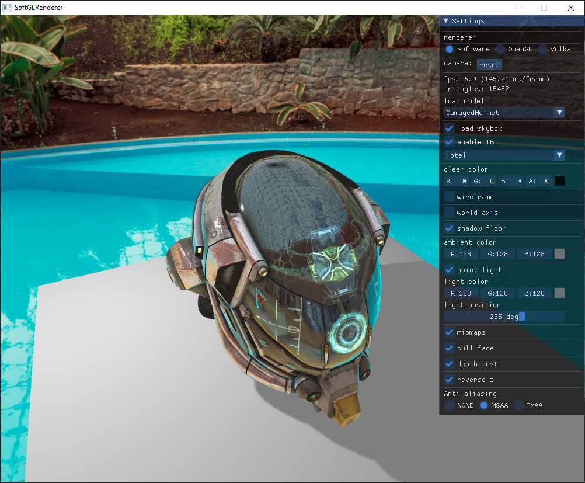

# SoftGLRender
Tiny C++ Software Renderer/Rasterizer, it implements the main GPU rendering pipeline, 3D models (GLTF) are loaded by [assimp](https://github.com/assimp/assimp), and using [GLM](https://github.com/g-truc/glm) as math library.

<div align="center">

[](./LICENSE)

[](https://github.com/keith2018/SoftGLRender/actions/workflows/cmake_macos.yml)
[](https://github.com/keith2018/SoftGLRender/actions/workflows/cmake_windows.yml)
[](https://github.com/keith2018/SoftGLRender/actions/workflows/cmake_linux.yml)

</div>



#### Code structure:

- [render](src/render): 
  - [soft](src/render/soft): software renderer implementation
  - [opengl](src/render/opengl): opengl renderer implementation
- [view](src/view): code for Viewer, mainly include GLTF loading (based on Assimp), camera & controller, setting panel, and render pass management.
  - [shader/soft](src/view/shader/soft): simulate vertex shader & fragment shader using c++, several basic shaders are embed such as blinn-phong lighting, skybox, PBR & IBL, etc.
  - [shader/opengl](src/view/shader/opengl): GLSL shader code

#### Renderer abstraction
```cpp
class Renderer {
 public:
  // config reverse z
  virtual void SetReverseZ(bool enable) {};
  virtual bool GetReverseZ() { return false; };

  // config early z
  virtual void SetEarlyZ(bool enable) {};
  virtual bool GetEarlyZ() { return false; };

  // framebuffer
  virtual std::shared_ptr<FrameBuffer> CreateFrameBuffer() = 0;

  // texture
  virtual std::shared_ptr<Texture> CreateTexture(const TextureDesc &desc) = 0;

  // vertex
  virtual std::shared_ptr<VertexArrayObject> CreateVertexArrayObject(const VertexArray &vertex_array) = 0;

  // shader program
  virtual std::shared_ptr<ShaderProgram> CreateShaderProgram() = 0;

  // uniform
  virtual std::shared_ptr<UniformBlock> CreateUniformBlock(const std::string &name, int size) = 0;
  virtual std::shared_ptr<UniformSampler> CreateUniformSampler(const std::string &name,
                                                               TextureType type,
                                                               TextureFormat format) = 0;

  // pipeline
  virtual void SetFrameBuffer(std::shared_ptr<FrameBuffer> &frame_buffer) = 0;
  virtual void SetViewPort(int x, int y, int width, int height) = 0;
  virtual void Clear(const ClearState &state) = 0;
  virtual void SetRenderState(const RenderState &state) = 0;
  virtual void SetVertexArrayObject(std::shared_ptr<VertexArrayObject> &vao) = 0;
  virtual void SetShaderProgram(std::shared_ptr<ShaderProgram> &program) = 0;
  virtual void SetShaderUniforms(std::shared_ptr<ShaderUniforms> &uniforms) = 0;
  virtual void Draw(PrimitiveType type) = 0;
};
```

#### Software Renderer Features

Pipeline

  - [x] Wireframe
  - [x] View Frustum culling
  - [x] Back-Front culling
  - [x] Orbit Camera Controller
  - [x] Perspective Correct Interpolation
  - [x] Tangent Space Normal Mapping
  - [x] Basic Lighting
  - [x] Blinn-Phong shading
  - [x] PBR & IBL shading
  - [x] Skybox CubeMap & Equirectangular
  - [x] Texture mipmaps
  - [x] Texture tiling and swizzling (linear, tiled, morton)
  - [x] Texture filtering and wrapping
  - [x] Shader derivative `dFdx` `dFdy`
  - [x] Alpha mask & blend
  - [x] Reversed Z
  - [x] Early Z

Texture Filtering

  - [x] NEAREST
  - [x] LINEAR
  - [x] NEAREST_MIPMAP_NEAREST
  - [x] LINEAR_MIPMAP_NEAREST
  - [x] NEAREST_MIPMAP_LINEAR
  - [x] LINEAR_MIPMAP_LINEAR

Texture Wrapping

  - [x] REPEAT
  - [x] MIRRORED_REPEAT
  - [x] CLAMP_TO_EDGE
  - [x] CLAMP_TO_BORDER
  - [x] CLAMP_TO_ZERO

Several texture fetch parameter are supported, such as `Lod`, `Bias`, `Offset`, to support texture mipmaps, the renderer pipeline has implement shader varying partial derivative function `dFdx` `dFdy`, rasterization operates on 4 pixels as a Quad, `dFdx` `dFdy` is the difference between adjacent pixel shader variables:

```cpp
/**
 *   p2--p3
 *   |   |
 *   p0--p1
 */
PixelContext pixels[4];
```

The storage of texture supports three modes:

- Linear: pixel values are stored line by line, commonly used as image RGBA buffer
- Tiled: block base storage, inside the block pixels are stored as `Linear`
- Morton: block base storage, inside the block pixels are stored as morton pattern (similar to zigzag)

#### Anti Aliasing

- [x] MSAA
- [x] FXAA

#### Shading

- [x] Blinn-Phong
- [x] PBR-BRDF

#### ShadowMap
- [x] PCF

#### Optimization
- Multi-Threading: rasterization is block based with multi-threading support, currently the triangle traversal algorithm needs to be optimized.
- SIMD: SIMD acceleration is used to optimize performance bottlenecks, such as barycentric coordinate calculation, shader's varying interpolation, etc.

## Showcase
### Render Textured

- BoomBox (PBR)
  

- Robot
  
  
- DamagedHelmet (PBR)
  

- GlassTable
  

- AfricanHead
  

- Brickwall
  

- Cube
  


## Dependencies
* [GLM](https://github.com/g-truc/glm)
* [json11](https://github.com/dropbox/json11)
* [stb_image](https://github.com/nothings/stb)
* [assimp](https://github.com/assimp/assimp)
* [imgui](https://github.com/ocornut/imgui)


## Clone
```bash
git clone git@github.com:keith2018/SoftGLRender.git
cd SoftGLRender
git submodule update --init --recursive
```

## Build

```bash
mkdir build
cmake -B ./build -DCMAKE_BUILD_TYPE=Release
cmake --build ./build --config Release
```

## Run

```bash
cd bin/Release
./SoftGLRender
```

## License
This code is licensed under the MIT License (see [LICENSE](LICENSE)).
